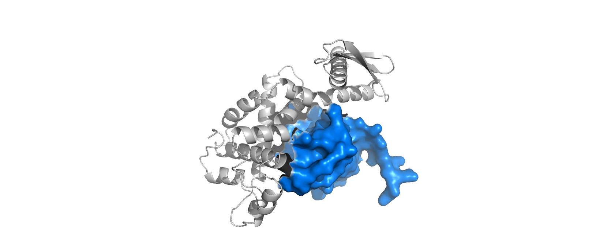
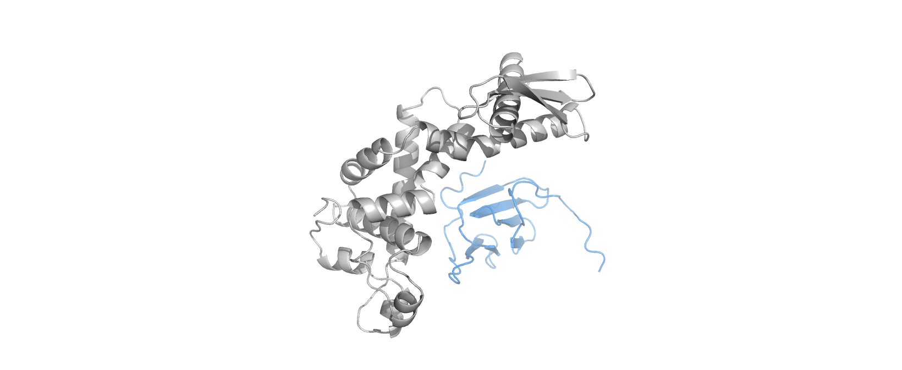
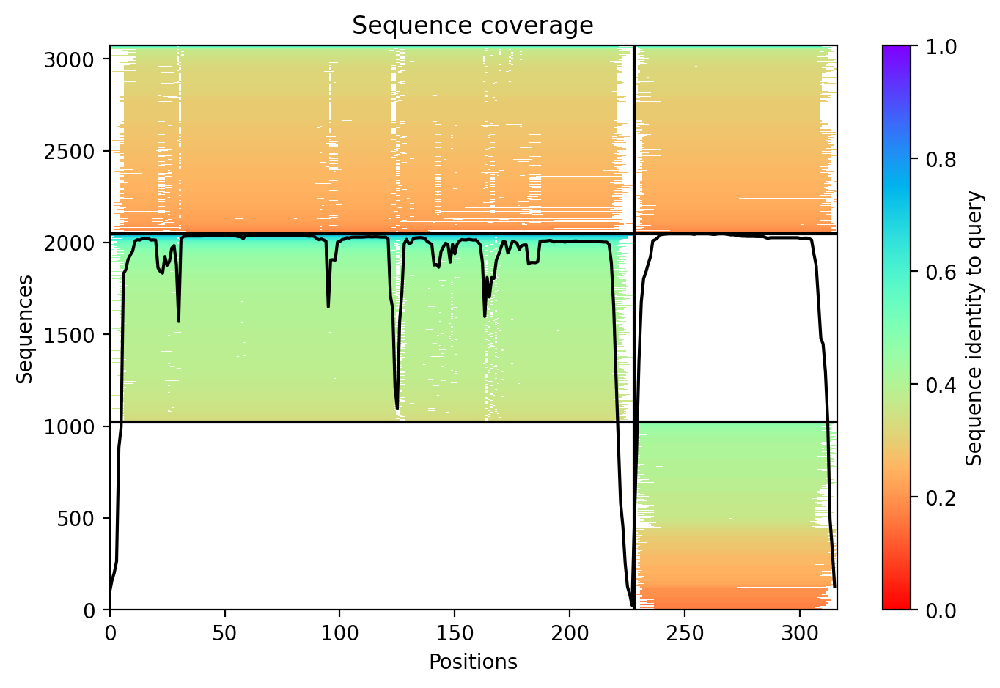
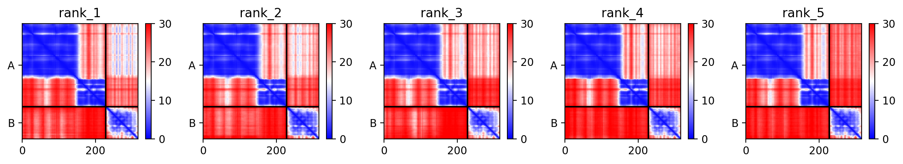
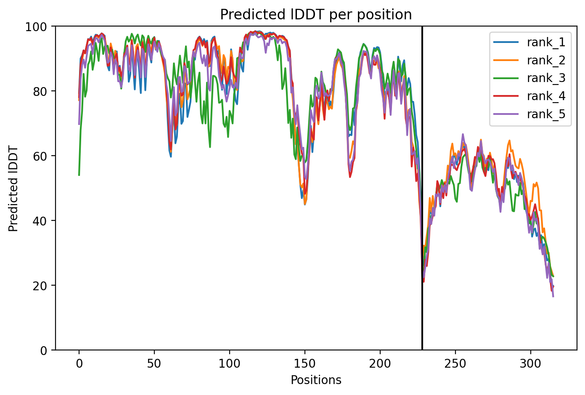

# Structural Analysis of Rnc-Mrnc Complex (Nostoc punctiforme)

### **Project Overview**
This study provides a high-confidence structural model of the interaction between **RNase III (Rnc)** and its regulator **Mrnc**. This complex is vital for the stress response in cyanobacteria.

### **Structural Visualizations**

#### **1. Surface Complementarity (Shape Fit)**

*Figure 1: Molecular surface of Mrnc (blue) docking into the Rnc (gray) catalytic domain.*

#### **2. Secondary Structure (Ribbon View)**

*Figure 2: Alignment of alpha-helices showing the internal structural 'handshake' between the two proteins.*

---
---
### **Methodology & Computational Workflow**

1. **Sequence Retrieval**: The protein sequences for **RNase III (Rnc)** and **Mrnc** were retrieved from the NCBI database for *Nostoc punctiforme* PCC 73102.
2. **Multiple Sequence Alignment (MSA)**: MSA was generated using the **MMseqs2** engine, achieving a sequence depth of 2,000. This provides a high evolutionary signal for folding.
3. **Structural Prediction**: The complex was modeled using **AlphaFold-Multimer (v1.5.5)** on the ColabFold platform.
4. **Visualization**: Secondary structure and molecular surface analysis were performed in **PyMOL** with ray-tracing for high-resolution detail.

---
---
### **Model Validation & Confidence Analysis**

To ensure the reliability of the in silico model, the following three validation pillars were analyzed:

#### **1. Multiple Sequence Alignment (MSA) Coverage**

*Figure 3: The MSA reached a depth of **2,000 sequences**. This Sequence coverage plot proves the model is backed by a massive evolutionary dataset, ensuring the structural folding is statistically robust.*

#### **2. Per-residue Confidence (pLDDT)**

*Figure 4: Local confidence scores for the Rnc catalytic core are consistently above $pLDDT > 80$ (High Confidence). The lower scores observed in the Mrnc subunit are consistent with its role as a small regulator; these regions likely represent intrinsically disordered or highly flexible loops that undergo a folding-upon-binding transition when interacting with the Rnc core.*

#### **3. Predicted Aligned Error (PAE) Matrix**

*Figure 5: The **dark blue regions** at the off-diagonal interfaces confirm that the relative orientation of the Rnc-Mrnc complex is a high-confidence prediction with low positional error.*

---
---
---
### **Biological Significance & Conclusion**

The structural model of the **Rnc-Mrnc** complex highlights a sophisticated regulatory "brake" mechanism in *Nostoc punctiforme*. 

1. **Steric Inhibition**: The docking of **Mrnc (Blue)** into the catalytic cleft of **Rnc (Gray)** suggests that Mrnc physically blocks the double-stranded RNA from entering the active site.
2. **Stress Adaptation**: By modulating RNase III activity, *Nostoc* can rapidly reprogram its transcriptome. This is essential for surviving environmental shifts, such as nitrogen starvation or high-light intensity.
3. **In Silico Validation**: This project successfully replicates experimental findings through AI-driven structural biology, demonstrating that the **AlphaFold-Multimer** pipeline can accurately predict specialized cyanobacterial regulatory interfaces.

**Conclusion**: This study provides a high-confidence structural framework for understanding post-transcriptional regulation in photosynthetic organisms, offering a template for future synthetic biology and metabolic engineering applications.
